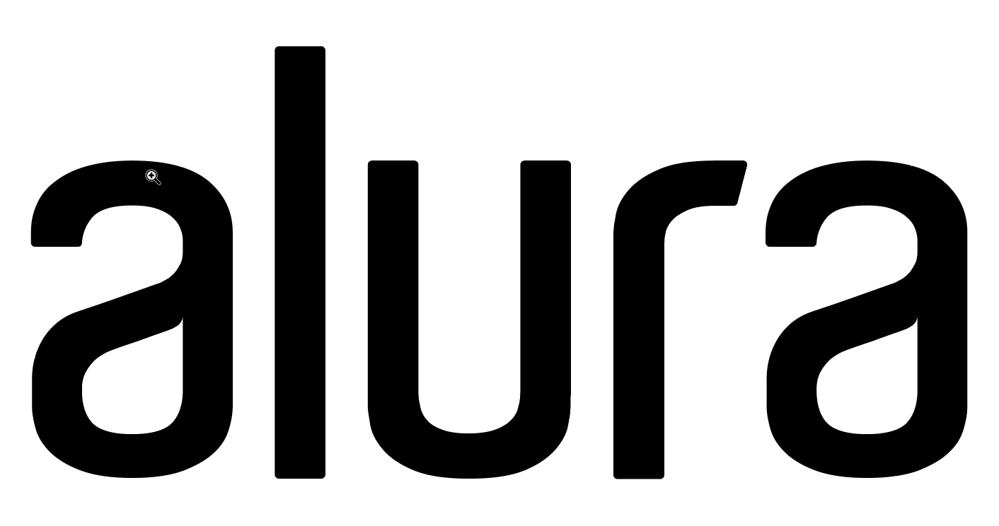
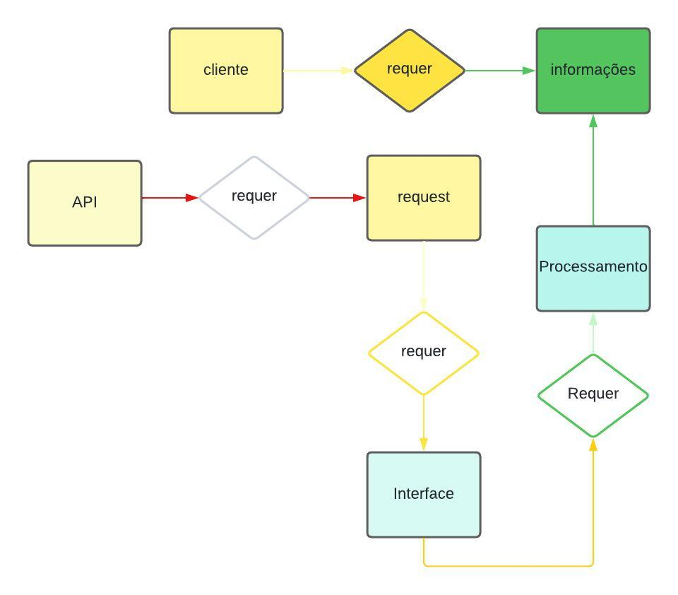

# Alura - Imersão IA 

# GeoPrevent🌍
Este projeto visa o desenvolvimento de uma interface com a aplicação da API Gemini do Google para fins de pesquisa e desenvolvimento global

Diagrama ER do projeto

